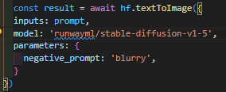
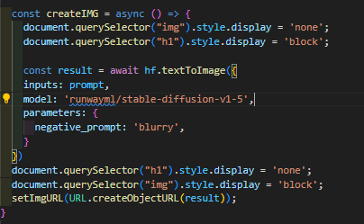

# Integracion de la IA
En este proyecto utilise la libreria **@huggingface/inference** para poder conectarme con los modulos de IA, lo que hace es conectarse con **Hugging Face** que es una plataforma paresida a github donde se guardan las IA creadas por la comunidad y las  grandes empresas como FACEBOOK, GOOGLE, ETC.

## Generate Img
El proyecto trata de generacion de imagenes atraves de prompt.

### Estructura
Cuenta con un input para resibir la prompt y un boton para generar la imagen y un loading cuando se esta generando la imagen.

### Logica
Para poder conectarse a la libreria se hace atraves de un token que te da la misma, con este token ya podemos ingresar a la propiedades que te da y utilizarlas, en las propiedades te pide un modulo (en el cueal los podes encontrar en la pagina de "Hugging Face") despues el modulo te pide otras propiedades segun el modulo que estes utilizando, en este caso lo que pide es un input(para agregar la prompt) y parametros en donde le vamos a mandar las condiciones que no qeremos que llegue la imagen.

En el input captamos la informacion que agrega el usuario y lo colocamos en un estado que se utiliza como la prompt, y con el boton ejecutamos una funcion en la cual se ejecuta el codigo de la libreria, mas en display para poder hacer un loading.

